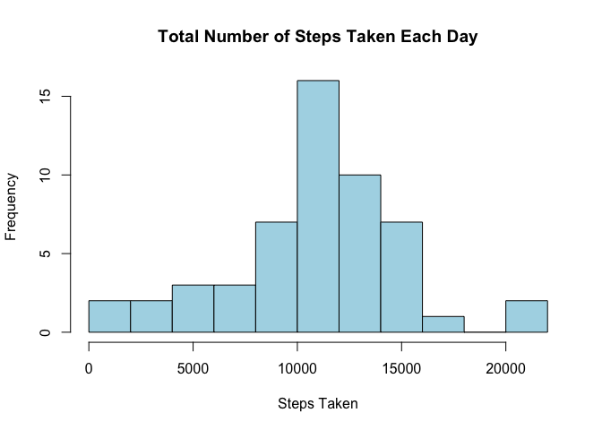
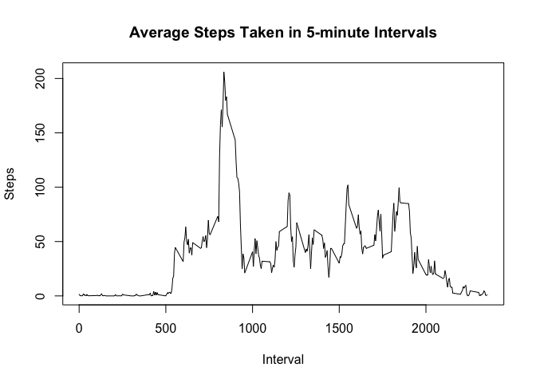
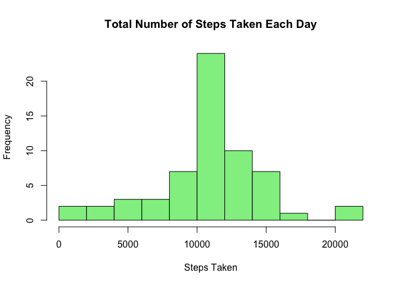

# Reproducible Research: Peer Assessment 1


## Loading and preprocessing the data

Load the data and preprocess the column classes

```r
dt <- read.csv("activity.csv", colClasses = c("integer", "Date", "integer"))
```

---

## What is mean total number of steps taken per day?

Calculate the total number of steps taken per day

```r
day <- aggregate(list(steps = dt$steps), by = list(date = dt$date), FUN = sum)
```

Make a histogram of the total number of steps taken each day

```r
hist(day$steps, xlab = "Steps Taken", breaks = 10, col = "light blue", 
     main = "Total Number of Steps Taken Each Day")
```

 

Calculate and report the mean and median total number of steps taken per day

```r
mean(day$steps, na.rm = TRUE)
```

```
## [1] 10766.19
```


```r
median(day$steps, na.rm = TRUE)
```

```
## [1] 10765
```

---

## What is the average daily activity pattern?

Calculate the average steps taken across all days in 5-minute intervals

```r
int <- aggregate(list(steps = dt$steps), by = list(interval = dt$interval), 
                      FUN = mean, na.rm = TRUE)
```

Make a time series plot of the average steps taken in 5-minute intervals

```r
plot(int$interval, int$steps, type = "l", xlab = "Interval", 
     ylab = "Steps", main = "Average Steps Taken in 5-minute Intervals")
```

 


Find the 5-minute interval which has the maximum average steps taken across all days

```r
int[which.max(int$steps), 1]
```

```
## [1] 835
```

The interval 08:35-08:40 contains the maximum average steps taken across all days

---

## Imputing missing values

Calculate and report the total number of missing values in the dataset

```r
sum(is.na(dt$steps))
```

```
## [1] 2304
```

Using the mean for 5-minute intervals, create a new dataset with the missing data filled in.

```r
dt_new <- dt
for(i in 1:nrow(dt_new)) {
        if(is.na(dt_new[i,1])) {
                dt_new[i,1] <- int[int$interval == dt_new[i,3], 2]
        }
}
```

Calculate a new total number of steps taken per day

```r
day_new <- aggregate(list(steps = dt_new$steps), by = list(date = dt_new$date), FUN = sum)
```

Make a new histogram of the total number of steps taken each day

```r
hist(day_new$steps, xlab = "Steps Taken", breaks = 10, col = "light green", 
     main = "Total Number of Steps Taken Each Day")
```

 

Calculate and report new mean and median total number of steps taken per day

```r
mean(day_new$steps)
```

```
## [1] 10766.19
```


```r
median(day_new$steps)
```

```
## [1] 10766.19
```
By imputing missing data with the means, we are seeing the following impact:  
- **Mean**: No change from the estimate in the first part  
- **Median**: Changes slightly, moving closer to the mean 
(in this case, exactly the same as mean)  

---

## Are there differences in activity patterns between weekdays and weekends?

Create a new factor variable in the dataset with two levels – “weekday” and “weekend”

```r
dt_new$day <- as.factor(ifelse(weekdays(dt_new$date) %in% c("Saturday","Sunday"), 
                                "Weekend", "Weekday"))
```

Calculate the average steps taken across all days in 5-minute intervals

```r
int_new <- aggregate(list(steps = dt_new$steps), 
                     by = list(interval = dt_new$interval, day = dt_new$day), FUN = mean)
```

Make a panel plot containing time series of the average steps taken in 5-minute intervals across all weekday days or weekend days

```r
library(lattice)
xyplot(steps ~ interval | day, data = int_new, type = "l", layout = c(1,2),
       xlab = "Interval", ylab = "Number of steps")
```

 
